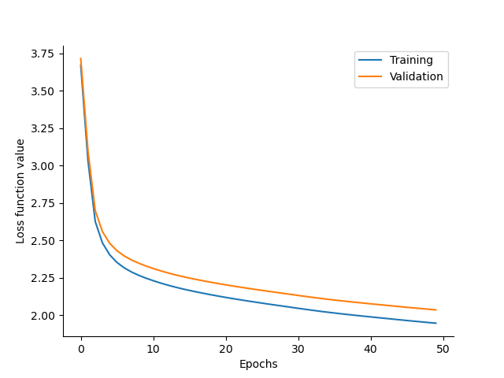

# Coupled Prototype 0

The purpose of this prototype is to establish a very simple coupled emulator
pipeline that we can further refine and scale up.
Although it has variables from atmosphere, ocean, sea ice and land components, which 
we also intend to have in a larger prototype, the set of variables considered from each
of these components is relatively much smaller. Below are the specifications of this 
prototype: 
- Atmosphere
    * Inputs: surface pressure, 10m zonal/meridional winds, 2m Temp, 3D temperature,
      year/day progress
    * Targets: surface pressure, 10m zonal/meridional winds, 2m Temp, 3D temperature,
    * Forcings: year/day progress
    * Vertical Levels: approximately 1000 hPa, 500 hPa, 100 hPa, but on the native model 
      vertical grid
- Ocean
    * Inputs: SSH, 3D temperature, 3D salinity, landsea_mask
    * Targets: SSH, 3D temperature, 3D salinity
    * Forcings: ()
    * Vertical Levels: approx. 0.5m, 50m, 200m 
- Sea Ice
    * Inputs: ice concentration, ice thickness
    * Targets: ice concentration, ice thickness
    * Forcings: ()
- Land
    * Inputs: soil moisture
    * Targets: soild moisture
    * Forcings: ()
- 6 hour time step and make up to 10 days ahead forecasts
- 1 degree horizontal resolution (C384)
- 1 year of training data
- 1 year of validation data
- Possible to evaluate on and with WeatherBench2
- Simple data normalization to get moving: data normalized based on avg/std taken over 1993-1997

The configuration is defined in [mini_coupled_emulator.py](mini_coupled_emulator.py).

## Training

Before training, clear any existing zarr stores or data, specified by the
`local_store_path` in [mini_coupled_emulator.py](mini_coupled_emulator.py).
For example:

```
$ rm -rf zarr-stores/loss.nc zarr-stores/data.zarr/ zarr-stores/models/
```

Then training can be executed with [train.py](train.py) as

```bash
$ python -W ignore train.py --num-epochs 2 --chunks-per-epoch 1 --latent-size 32 --training-dates "1994-01-01T00" "1994-01-31T18"
```

which shows a quick example of executing two epochs over 1 month of data, where
the month of data is contained in a single chunk. Change this value in order to 
distribute the data over multiple chunks.The first epoch caches the data on disk 
for the second epoch onwards so training should be faster from 2nd+ epochs. If 
you wish to use the values defined in the config file, you do not need to set 
these flags again here.
Caution: make sure that the "target_lead_time" hyperparameter is single valued for
training else you would receive crazy jax errors. Right now, graph-ufs is not
coded to optimize for multiple lead times. 

This should produce 2 networks, 1 per epoch, at `zarr-stores/models`. The number
of models is equal to epochs times the number of chunks per epoch.

```
$ ls zarr-stores/models/
model_0.npz  model_1.npz
```
```
$ ncdump -v loss zarr-stores/loss.nc
netcdf loss {
dimensions:
	optim_step = 16 ;
	var_index = 11 ;
	var_names = 11 ;
variables:
	float loss(optim_step) ;
		loss:_FillValue = NaNf ;
		loss:long_name = "loss function value" ;
	float loss_valid(optim_step) ;
		loss_valid:_FillValue = NaNf ;
		loss_valid:long_name = "validation loss function value" ;
	float loss_by_var(var_index, optim_step) ;
		loss_by_var:_FillValue = NaNf ;
	double learning_rate(optim_step) ;
		learning_rate:_FillValue = NaN ;
	int64 optim_step(optim_step) ;
	int64 var_index(var_index) ;
	string var_names(var_names) ;

// global attributes:
		:batch_size = 16LL ;
data:

 loss = 4.556444, 4.985181, 4.93081, 4.514584, 4.726346, 4.753759, 4.097644, 
    4.098628, 3.667516, 4.208126, 4.237391, 3.891592, 4.144828, 4.243155, 
    3.619147, 3.669657 ;
}
```

## Evaluation
At this stage, you can change the "target_lead_time" to make it a list instead 
of a single value. graph-ufs is able to produce forecasts for multiple lead times.
To test the last model checkpoint i.e. `model_1.npz`
```
$ python -W ignore train.py --test --id 1 --testing-dates  "1995-01-01T00"  "1995-01-31T18"
Processing: 100%|█████████████████████████████████████████████████████████████████████████████████████████████████████████████████| 8/8 [00:36<00:00,  4.53s/it]
```
Note that no statistics is printed here as we are not comparing it with weatherbench2 
dataset. Doing this throws errors as Weatherbench doesn't have anything other than atmospheric 
variables.

## Loss over 1 year of training
Training on 1 year of data will produce the following loss curve, indicating things are going in the
right direction.



See [plot_loss.ipynb](plot_loss.ipynb) for the plot and plots of loss by
variable.

## Notes: 
The normalization fields were computed using
[calc_normalization.py](calc_normalization.py). This code should be generalized 
in the future, and could probably be more efficient, e.g. with a dask cluster 
rather than brute force slurm job submission. Additionally, the averaging may 
need to take into account a more accurate grid cell volume weighted average.

## Training Schedule
The learning rate is constant in this prototype. In CP1, we intend to use 
the same cosine annealing learning rate as used in graph-ufs P1 prototype.
Below is the first stage of the three phases of training of the original 
graphcast as an example, including their definition of the AdamW optimizer.
This could be dropped into [train.py](train.py) in place of the optimizer
definition as follows

```python
# linearly increase learning rate
n_linear = gufs.num_epochs * gufs.chunks_per_epoch * len(data["inputs"]["optim_step"])
schedule_1 = optax.linear_schedule(
    init_value=0.0,
    end_value=1e-3,
    transition_steps=n_linear,
)
# curriculum and parameters as in GraphCast
optimizer = optax.chain(
    optax.clip_by_global_norm(32),
    optax.adamw(
        learning_rate=schedule_1,
        b1=0.9,
        b2=0.95,
        weight_decay=0.1,
    ),
)
```


## XLA Optimization Flags

On the PSL GPU cluster, we saw no benefit to adding [these flags suggested by
JAX](https://jax.readthedocs.io/en/latest/gpu_performance_tips.html#xla-performance-flags),
in fact they slowed things down significantly.
On Perlmutter, we got errors on using the default/latest version of jax and jaxlib, but 
downgrading jaxlib to 0.4.26 did the trick.
