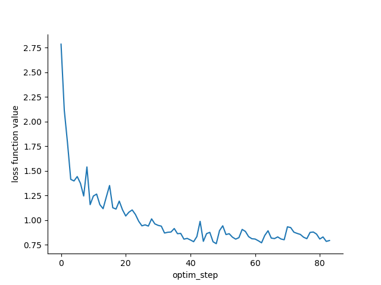

# Prototype 0

The purpose of this prototype is to establish a very simple weather emulator
pipeline that we can further refine and scale up.
Compared to GraphCast, this has:
- Reduced variable set
    * Inputs: surface pressure, 10m zonal/meridional winds, 3D temperature,
      year/day progress
    * Targets: surface pressure, 10m zonal/meridional winds, 3D temperature,
    * Forcings: land, year/day progress
- 3 vertical levels: approximately 1000 hPa, 500 hPa, 100 hPa, but on the native
  FV3 vertical grid
- 6 hour time step and make 1 step ahead predictions
- 1 degree horizontal resolution (C384)
- 1 year of training data
- 1 year of evaluation data
- Evaluate on and with WeatherBench2
- Simple data normalization just to get moving: data normalized based on avg/std taken over 1994-1997

The configuration is defined in [simple_emulator.py](simple_emulator.py).

## Training

Before training, clear any existing zarr stores or data, specified by the
`local_store_path` in [simple_emulator.py](simple_emulator.py).
For example:

```
$ rm -rf zarr-stores/loss.nc zarr-stores/data.zarr/ zarr-stores/models/
```

Then training can be executed with [train.py](train.py) as

```bash
$ python -W ignore train.py --num-epochs 2 --chunks-per-epoch 2 --latent-size 32 --training-dates "1994-01-01T00" "1994-01-31T18"
```

which shows a quick example of executing two epochs over 1 month of data, where
the month of data is split into two chunks.
The first epoch caches the data on disk for the second epoch onwards so training should be faster from 2nd+ epochs.

This should produce 4 networks, 2 per epoch, at `zarr-stores/models`

```
$ ls zarr-stores/models/
model_0.npz  model_1.npz  model_2.npz  model_3.npz
```

Since we are doing 3 steps per chunk, a total of 4 x 3 = 12 losses should be accumulated

```
$ ncdump -v loss zarr-stores/loss.nc
netcdf loss {
dimensions:
	optim_step = 12 ;
	var_index = 4 ;
	var_names = 4 ;
variables:
	int64 optim_step(optim_step) ;
	int64 var_index(var_index) ;
	string var_names(var_names) ;
	float loss(optim_step) ;
		loss:_FillValue = NaNf ;
		loss:long_name = "loss function value" ;
	float loss_by_var(var_index, optim_step) ;
		loss_by_var:_FillValue = NaNf ;

// global attributes:
		:batch_size = 16LL ;
data:

 loss = 2.594727, 2.493164, 2.432617, 2.442871, 2.381348, 2.306641, 2.172852,
    2.123047, 2.07373, 1.853516, 1.772461, 1.742188 ;
}
```

## Evaluation

To test the last model i.e. `model_3.npz`

```
$ python -W ignore train.py --chunks-per-epoch 1 --latent-size 32 --test --id 3 --testing-dates  "1995-01-01T00"  "1995-01-31T18"
Chunks total: 1
Chunk 0: 1995-01-01 00:00:00 to 1995-01-31 18:00:00
 --- Loading weights: ./zarr-stores/models/model_3.npz ---
Elapsed time: 0.0196 seconds

 --- Starting Testing ---
Testing on chunk 0
Processing: 100%|█████████████████████████████████████████████████████████████████████████████████████████████████████████████████████████████████████████████████████████████| 7/7 [00:50<00:00,  7.21s/it]
--------- Statistiscs ---------
pressfc                         : RMSE: 274.6962890625 BIAS: -10.097412109375
tmp                             : RMSE: 1.921684980392456 BIAS: -0.40056389570236206
ugrd10m                         : RMSE: 2.8340179920196533 BIAS: 0.21854324638843536
vgrd10m                         : RMSE: 3.079197645187378 BIAS: -1.7278567552566528
Total Walltime: 55.5004 seconds
```

Note that we can run this successfully with 2 or more chunks, but the discontinuity created at chunk boundaries is apparently an issue with WeatherBench2 evaluation.
To evaluate with WeatherBench2 if necessary, make sure the dates in the script match with what you run testing on.

```
$ cd ../..
$ ./evaluate-graphufs.sh
No land_sea_mask found.
W0328 12:17:50.383941 139759771653952 _metadata.py:139] Compute Engine Metadata server unavailable on attempt 1 of 3. Reason: timed out
W0328 12:17:50.429847 139759771653952 _metadata.py:139] Compute Engine Metadata server unavailable on attempt 2 of 3. Reason: [Errno 113] No route to host
W0328 12:17:53.433954 139759771653952 _metadata.py:139] Compute Engine Metadata server unavailable on attempt 3 of 3. Reason: timed out
W0328 12:17:53.434175 139759771653952 _default.py:338] Authentication failed using Compute Engine authentication due to unavailable metadata server.
W0328 12:17:53.520377 139759771653952 _metadata.py:205] Compute Engine Metadata server unavailable on attempt 1 of 5. Reason: HTTPConnectionPool(host='metadata.google.internal', port=80): Max retries exceeded with url: /computeMetadata/v1/instance/service-accounts/default/?recursive=true (Caused by NameResolutionError("<urllib3.connection.HTTPConnection object at 0x7f1b3e3e5190>: Failed to resolve 'metadata.google.internal' ([Errno -2] Name or service not known)"))
W0328 12:17:53.638942 139759771653952 _metadata.py:205] Compute Engine Metadata server unavailable on attempt 2 of 5. Reason: HTTPConnectionPool(host='metadata.google.internal', port=80): Max retries exceeded with url: /computeMetadata/v1/instance/service-accounts/default/?recursive=true (Caused by NameResolutionError("<urllib3.connection.HTTPConnection object at 0x7f1b3d8265d0>: Failed to resolve 'metadata.google.internal' ([Errno -2] Name or service not known)"))
W0328 12:17:53.708961 139759771653952 _metadata.py:205] Compute Engine Metadata server unavailable on attempt 3 of 5. Reason: HTTPConnectionPool(host='metadata.google.internal', port=80): Max retries exceeded with url: /computeMetadata/v1/instance/service-accounts/default/?recursive=true (Caused by NameResolutionError("<urllib3.connection.HTTPConnection object at 0x7f1b3d826bd0>: Failed to resolve 'metadata.google.internal' ([Errno -2] Name or service not known)"))
W0328 12:17:53.808346 139759771653952 _metadata.py:205] Compute Engine Metadata server unavailable on attempt 4 of 5. Reason: HTTPConnectionPool(host='metadata.google.internal', port=80): Max retries exceeded with url: /computeMetadata/v1/instance/service-accounts/default/?recursive=true (Caused by NameResolutionError("<urllib3.connection.HTTPConnection object at 0x7f1b3d830590>: Failed to resolve 'metadata.google.internal' ([Errno -2] Name or service not known)"))
W0328 12:17:53.879918 139759771653952 _metadata.py:205] Compute Engine Metadata server unavailable on attempt 5 of 5. Reason: HTTPConnectionPool(host='metadata.google.internal', port=80): Max retries exceeded with url: /computeMetadata/v1/instance/service-accounts/default/?recursive=true (Caused by NameResolutionError("<urllib3.connection.HTTPConnection object at 0x7f1b3d831b90>: Failed to resolve 'metadata.google.internal' ([Errno -2] Name or service not known)"))
I0328 12:17:54.102175 139759771653952 evaluation.py:311] Loading data
I0328 12:17:54.128559 139759771653952 evaluation.py:400] Logging metric: mse
I0328 12:17:54.185155 139759771653952 evaluation.py:425] Logging metric done: mse
I0328 12:17:54.185217 139759771653952 evaluation.py:400] Logging metric: acc
I0328 12:18:05.715586 139759771653952 evaluation.py:425] Logging metric done: acc
I0328 12:18:05.715660 139759771653952 evaluation.py:400] Logging metric: bias
I0328 12:18:05.749613 139759771653952 evaluation.py:425] Logging metric done: bias
I0328 12:18:05.749665 139759771653952 evaluation.py:400] Logging metric: mae
I0328 12:18:05.784231 139759771653952 evaluation.py:425] Logging metric done: mae
I0328 12:18:05.945983 139759771653952 evaluation.py:467] Logging Evaluation complete:
<xarray.Dataset>
Dimensions:                  (optim_step: 1, level: 3, metric: 4)
Coordinates:
  * optim_step               (optim_step) int64 0
  * level                    (level) float32 100.0 500.0 1e+03
  * metric                   (metric) object 'acc' 'bias' 'mae' 'mse'
    lead_time                timedelta64[ns] 00:00:00
Data variables:
    surface_pressure         (metric, optim_step) float64 dask.array<chunksize=(4, 1), meta=np.ndarray>
    temperature              (metric, optim_step, level) float64 dask.array<chunksize=(4, 1, 3), meta=np.ndarray>
    10m_u_component_of_wind  (metric, optim_step) float64 dask.array<chunksize=(4, 1), meta=np.ndarray>
    10m_v_component_of_wind  (metric, optim_step) float64 dask.array<chunksize=(4, 1), meta=np.ndarray>
    10m_wind_vector          (metric, optim_step) float64 dask.array<chunksize=(4, 1), meta=np.ndarray>
I0328 12:18:06.010518 139759771653952 evaluation.py:471] Logging Saved results to ./graphufs_deterministic.nc
```

## Loss over 1 year of training


Training on 1 year of data will produce the following loss curve, indicating things are going in the
right direction.



See [plot_loss.ipynb](plot_loss.ipynb) for the plot and plots of loss by
variable.


## Notes

## Normalization

The normalization fields were computed using
[calc_normalization.py](calc_normalization.py), and there
are many unnecessary hard coded values.
This code should be generalized in the future, and could probably be more
efficient, e.g. with a dask cluster rather than brute force slurm job
submission.
Some points of generalization include:
- storage location input/output (which would generalize resolution and model
  component)
- time frame and data frequency (timestep) used
- the averaging may need to take into account a more accurate grid cell volume
  weighted average
- the `year_progress` and `day_progress` fields are computed by graphcast, and
  these calculations should go here so that the correct normalization can be
  computed. Right now those normalization values are hard coded into
  `graphufs.ReplayEmulator.load_normalization`


## Training Schedule


At this stage, it doesn't make sense to add the full learning rate schedule
that is done in GraphCast.
However, here is the first stage of their three phases of training as an
example, including their definition of the AdamW optimizer.
This could be dropped into [train.py](train.py) in place of the optimizer
definition as follows

```python
# linearly increase learning rate
n_linear = gufs.num_epochs * gufs.chunks_per_epoch * len(data["inputs"]["optim_step"])
schedule_1 = optax.linear_schedule(
    init_value=0.0,
    end_value=1e-3,
    transition_steps=n_linear,
)
# curriculum and parameters as in GraphCast
optimizer = optax.chain(
    optax.clip_by_global_norm(32),
    optax.adamw(
        learning_rate=schedule_1,
        b1=0.9,
        b2=0.95,
        weight_decay=0.1,
    ),
)
```


## XLA Optimization Flags

On the PSL GPU cluster, we saw no benefit to adding [these flags suggested by
JAX](https://jax.readthedocs.io/en/latest/gpu_performance_tips.html#xla-performance-flags),
in fact they slowed things down significantly.
